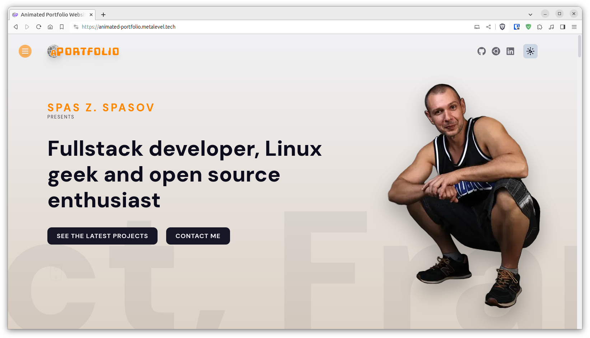
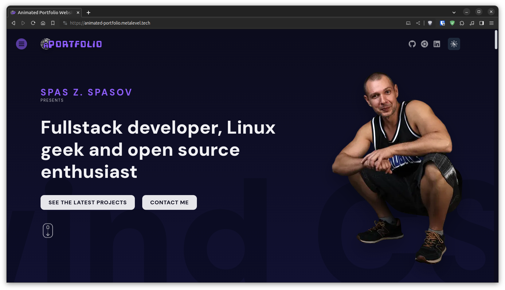

# Animated Portfolio

[](https://animated-portfolio.metalevel.tech/)

[](https://animated-portfolio.metalevel.tech/)

This project is based on the Lama Dev's YouTube tutorial [Animated Portfolio Website with React & Framer Motion](https://youtu.be/CHGHuF24Cjw?si=2nGDLPBEXwe-Wr1o). Here is a Next.js 13 version of the project from the tutorial, also it uses [Tailwind CSS](https://tailwindcss.com/), [Shadcn/UI](https://ui.shadcn.com/) and some additional features.

## Features and technologies in use

- Next.js 14
  - Server actions
  - Custom React hooks
- Tailwind CSS, custom theme
- Sass CSS
- Shadcn/UI components
- Dark, light and system mode
- Framer Motion
- Parallax images with scrolling
- SVG animation
- Custom fonts and logo
- Resend for email sending
- Dorm validation with React hook form and Zod
- Google reCaptcha v3 for spam prevention

## References and credits

- [Animated Portfolio Website with React & Framer Motion](https://youtu.be/CHGHuF24Cjw?si=2nGDLPBEXwe-Wr1o)

- [Safak at GitGub: Animated Portfolio](https://github.com/safak/animated-portfolio/tree/starter)

This is a [Next.js](https://nextjs.org/) project bootstrapped with [`create-next-app`](https://github.com/vercel/next.js/tree/canary/packages/create-next-app) and hosted on [Vercel](https://vercel.com/).

## Getting Started Dev

Install the dependencies:

```bash
npm install
```

In addition you may want to create a Vercel project and link it to the repository then you can manage the environment variables from the Vercel admin panel.

Run the development server:

```bash
npm run dev
```

Open [http://localhost:3001](http://localhost:3001) with your browser to see the result.

## Reference manual

- TailwindCSS: [Using with Preprocessors](vscodethemes.com/e/juliettepretot.lucy-vscode/lucy?language=javascript)
- [Framer Motion](https://www.framer.com/)
- [SVG Repo](https://www.svgrepo.com/)
- *Email*
  - [Resend](https://resend.com/) *currently in use*
  - [Resend YouTube Tutorial by Brett Westwood](https://youtu.be/T2xaiw7VK4A?si=KiKDXDtTiagPNbzv)
  - [React email](https://react.email/docs/introduction)
  - [Sending Emails with `Nodemailer` in Next.js 2023](https://javascript.plainenglish.io/sending-emails-with-nodemailer-in-next-js-ccada06abfc9)
  - [EmailJs](https://www.emailjs.com/)
- *reCaptcha*
  - [Google reCaptcha Admin](https://www.google.com/recaptcha/admin/)
  - [Google reCaptcha Guides](https://developers.google.com/recaptcha/docs/v3)
  - [Add Google ReCAPTCHA V3 In A Next.Js Form](https://www.techomoro.com/how-to-add-google-recaptcha-v3-in-a-next-js-form/) *currently in use*
  - [npm: `react-google-recaptcha-v3`](https://www.npmjs.com/package/react-google-recaptcha-v3#enterprise) *currently in use*
  - [npm: `next-recaptcha-v3`](https://www.npmjs.com/package/next-recaptcha-v3)
  - [Integrate Google reCAPTCHA v2 With Next.js 13](https://medium.com/@danielcracbusiness/integrate-google-recaptcha-v2-with-next-js-13-in-under-10-minutes-f25a286bb19e)
  - [Integrate Google reCAPTCHA v3 With Next.js 13](https://javascript.plainenglish.io/how-to-implement-google-recaptcha-v3-in-next-js-b1436e68c70a)
